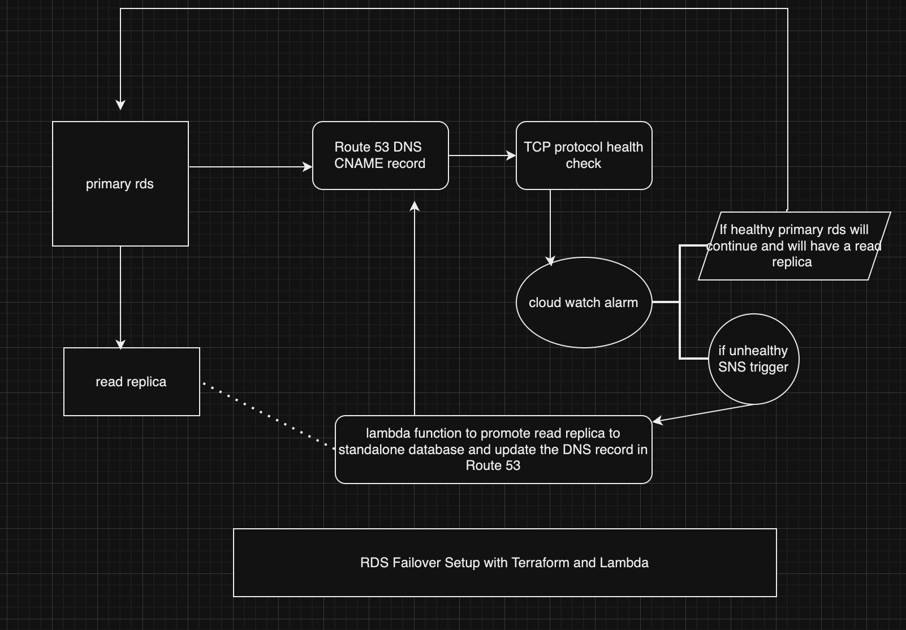

# RDS Failover Setup with Terraform and Lambda

This guide outlines the steps to set up a primary RDS, a read replica in different regions, and automate failover using AWS Lambda.

## Prerequisites

1. AWS account with permissions to create RDS, Route 53, IAM roles, Lambda, and other resources.
2. Terraform installed locally.
3. AWS CLI installed and configured.

---

## Steps

## 1. Create Primary RDS and Read Replica
## 2. Create Hosted Zone and CNAME Record
## 3. Create Health Check for Primary RDS
## 4. Create IAM Role for Lambda
## 5. Set Up Lambda for Failover
## 6. Trigger Failover Process

1. **Edit Security Group and NACL**:
   - Block inbound/outbound traffic on port 3306 for the primary RDS.

2. **Check Route 53 Health Check**:
   - Confirm the health check status changes to `Unhealthy`.

3. **Trigger Lambda via CloudWatch Alarm**:
   - Configure CloudWatch Alarm to monitor the health check.
   - Set the alarm to publish a message to the SNS topic.

4. **Verify Failover**:
   - Ensure the DNS record points to the new RDS instance.
   - Test database connectivity by writing to the new RDS endpoint.

---

## Validation

- Validate that the primary RDS is unavailable.
- Verify the read replica is promoted successfully.
- Check the Route 53 DNS record update.
- Ensure application connectivity to the new endpoint.
